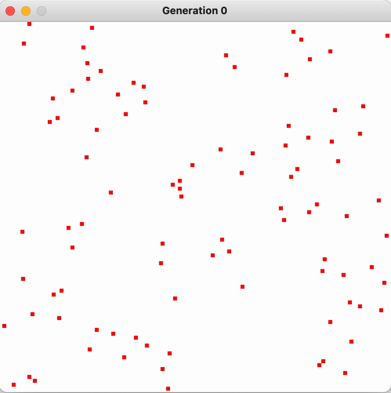
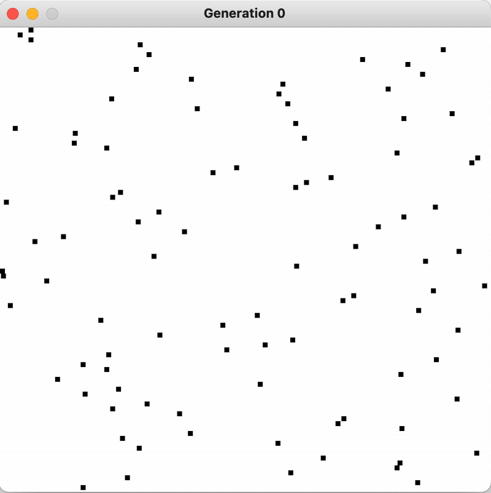
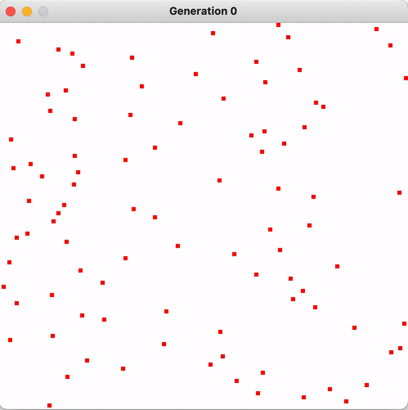

# AI_Evolution

A simple Java implementation of a genetic algorithm that teaches AI agents to walk in a straight line. Over successive generations, the agents evolve their behavior using randomized mutation and fitness-based selection.

## Demonstration gifs

A demonstration of the default constructor for AI_Evolution. 

A demonstration of the constructor for AI_Evolution used in AI_Evolution.java on line 89. 

A demonstration of the constructor for AI_Evolution used in AI_Evolution.java on line 92. With the exception that the view_rate parameter was set to 5 instead of 100 for demonstration purposes. (Note the framerate of the gif and the rendering of steps may not match, causing the output to look slower and less helpful than it would when being run) 

## Motivation

This project was built as a personal experiment to better understand genetic algorithms and evolutionary learning. It visualizes how random mutation and selection can produce increasingly effective behavior over time, even in a simple environment.

## How It Works

- Each "agent" has a genome (set of movement instructions).
- Agents attempt to walk in a straight line on a virtual grid or plane.
- After each generation, performance (distance walked straight) is evaluated.
- The best-performing agent is selected to "reproduce" and mutate, creating a new generation.
- Over time, the population evolves more effective walking behaviors.

## Technologies Used

- Java (Object-Oriented Programming)
- Basic Java GUI
- No external libraries required

## Getting Started

1. Clone this repository:
git clone https://github.com/JoshRissman/AI_Evolution.git

2. (Optional) Inside the AI_Evolution.java files's AI_Evolution class's void main(String[] args) function, change the call(s) to the constructors of AI_Evolution in accordance to your desired parameters.

3. Compile and run the AI_Evolution.java class:
javac AI_Evolution.java
java AI_Evolution

> Make sure you have Java installed and set up in your PATH.

## Project Structure

- `AI_Evolution` – Runs the simulation  
- `AI_Ev` – Defines the AI agent and its behavior 

## License

© 2025 Josh Rissman. This code is made available for viewing purposes only. All rights reserved.  
**No permission is granted to use, copy, modify, or distribute this code.**

## Contact

If you'd like to ask questions or discuss the project, feel free to reach out:  
[LinkedIn](https://www.linkedin.com/in/joshua-rissman)
